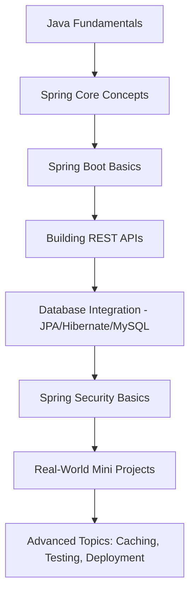

<!-- Modern & Attractive GitHub README for Spring Boot Learning Repo -->

<h1 align="center">🌱 Spring Boot Learning Journey</h1>

<p align="center">
  
  
  
</p>

---

## ✨ About This Repo

This repository is my **personal playground** 🎮 to learn, explore, and experiment with **Spring Boot**.
It’s not just notes or boring code dumps – I’ve structured it like a **modern learning space** with mini-projects, hands-on experiments, and real-world use cases.

> ⚡ **Goal:** To build a strong foundation in Spring Boot while creating reusable, well-documented code snippets.

---

## 🎯 What's Inside?

✅ Step-by-step projects & demos
✅ Hands-on practice for REST APIs
✅ Database integrations (JPA, Hibernate, MySQL, etc.)
✅ Security basics with Spring Security
✅ Real-world mini applications
✅ Notes, tips & resources I find useful

---

## 📂 Repo Structure (Planned / Ongoing)

```
spring-boot-learning/
│── 📘 notes/             → Short guides, tips & resources  
│── ⚡ demos/             → Mini projects for each concept  
│── 🔒 security/          → Spring Security practice  
│── 🗄️ database/          → DB integration experiments  
│── 🚀 projects/          → Real-world style small projects  
│── README.md             → You are here 😉
```

---

## 🛣️ My Spring Boot Roadmap

Here’s the path I’m following 🚀:



### ✅ Progress Tracker

* [x] Java Fundamentals
* [x] Spring Core Concepts
* [x] Spring Boot Basics
* [x] Building REST APIs
* [x] Database Integration - JPA/Hibernate/MySQL
* [ ] Spring Security Basics
* [ ] Real-World Mini Projects
* [ ] Advanced Topics: Caching, Testing, Deployment

---

## 🖼️ UI Showcase (Future Vision)

I want to turn this repo into a **modern UI learning hub**.
Imagine:

* 📊 Interactive diagrams
* 🎨 Visual project roadmaps
* 🧑‍💻 Clean, modern code style

---

## 🛠️ Tech Stack

<p align="center">
  
</p>

---

## 🌍 Connect With Me

<p align="center">
  <a href="https://github.com/Harivignesh-33"></a>
  <a href="https://www.linkedin.com/in/-hari-k"></a>
</p>

---

<h3 align="center">⭐ Learning never stops. This repo grows as I grow. ⭐</h3>
